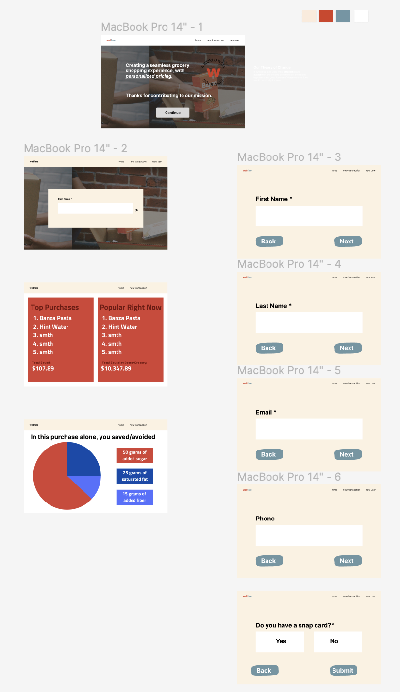
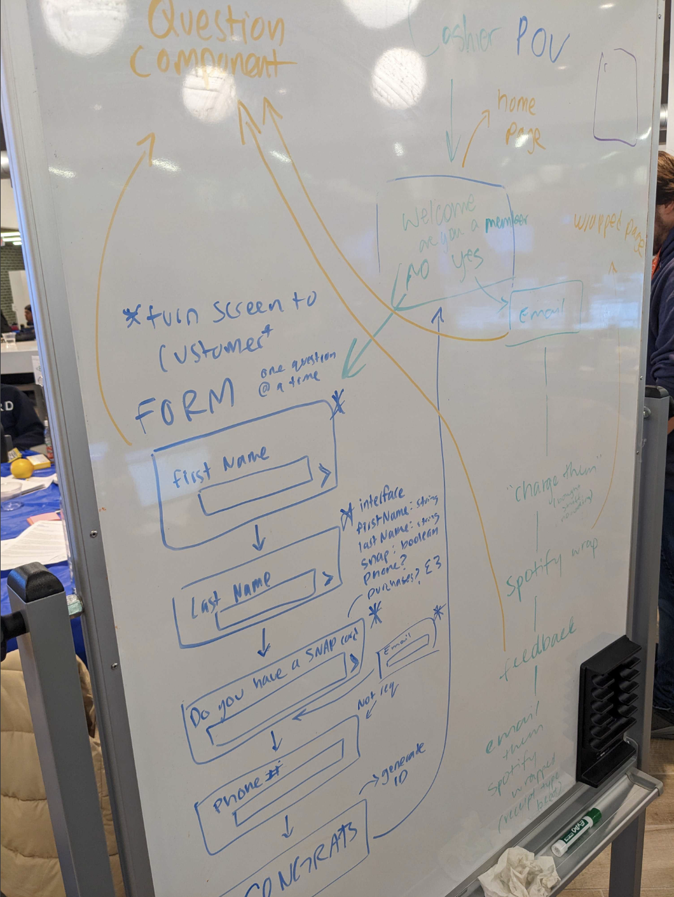

# Team 7

## Frontend
From the root directory, ```cd``` into ```client``` and run ```npm install```.

To run the app locally, run ```npm start```.

## Backend
We used MongoDB and SQL.

## Design and Prototyping
 (https://www.figma.com/file/04ZKGQmjmejJ5oieQGQuGB/Open-Invite?type=design&node-id=0%3A1&mode=design&t=mfxURvdToGPKI82K-1)
Figma Design



Original Prototype


