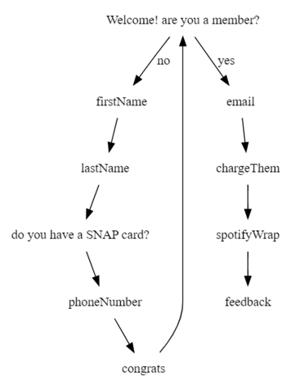

# Team 7

## Frontend
From the root directory, ```cd``` into ```client``` and run ```npm install```.

To run the app locally, run ```npm start```.

 The frontend is built with React.js.

 
## Backend
We use MongoDB to store data and SQL to communicate with databases.


## Design and Prototyping
 (https://www.figma.com/file/04ZKGQmjmejJ5oieQGQuGB/Open-Invite?type=design&node-id=0%3A1&mode=design&t=mfxURvdToGPKI82K-1)

Figma Design





Original Prototype


## Challenges
Our team started on this project with little to no experience with working with backend technologies. Our initial challenge was the extensive research required to understand the sending and receiving of requests to and from APIs. Additionally, in the beginning we were also unsure on what the scope of our project should be (whether to focus on membership sign up, authentication and security, or something entirely new).

For all of us, this was our first ever hackathon so staying up for the whole night was a challenge. Lastly, not all of us has experience working with a specific language (JavaScript, SQL, etc.), so we had to overcome syntax errors while nagivating the languages.


## What We Learned
Our journey was a valuable learning experience. It taught us how to adapt and set realistic goals within the constraints of time and our collective knowledge. Furthermore, we learn to step outside of our comfort zones and use new technologies such as MongoDB and SQL to efficiently store information in databases and retrieve important information using APIs. 
We also learn the importance of reaching out for help when needed, as everyone is willing to help and hope to see us reach our goals. Most importantly, we learn that we could have fun while building innovative solutions. In the end, we were able to come up with a MVP prototype that we are all proud of!
